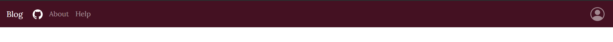
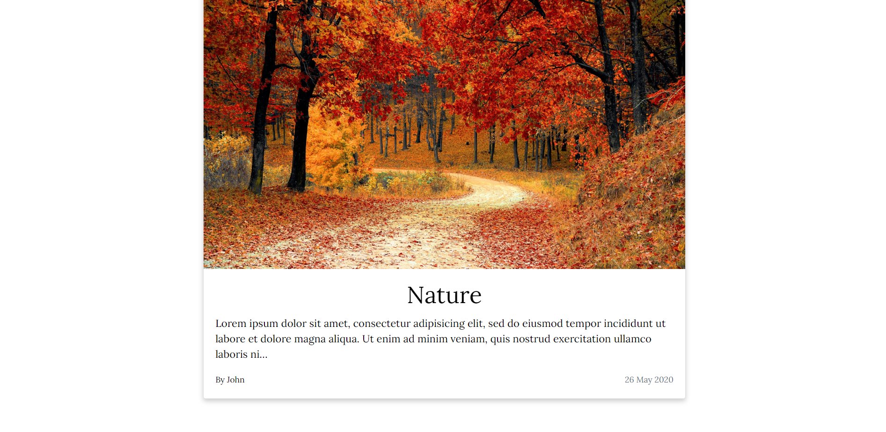
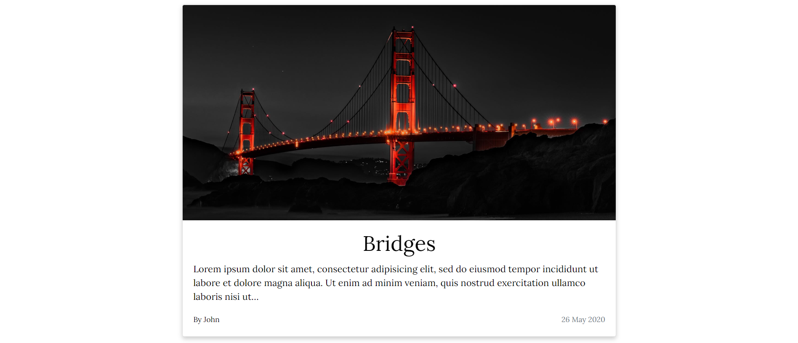
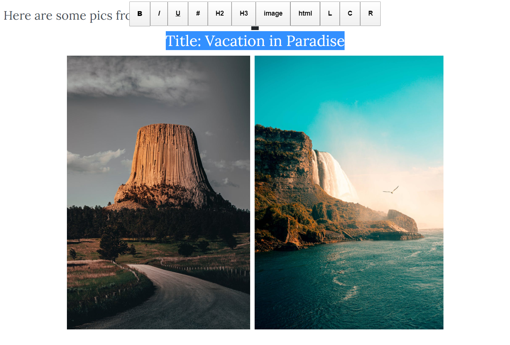
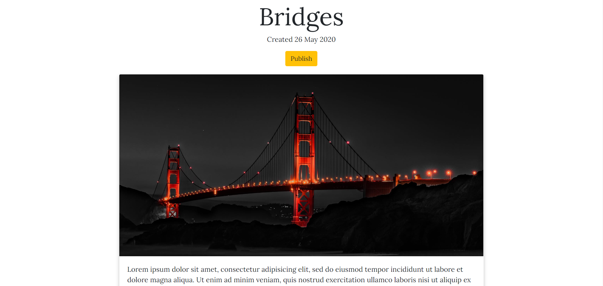
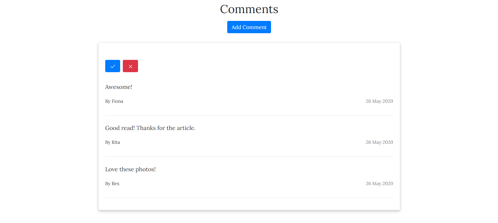
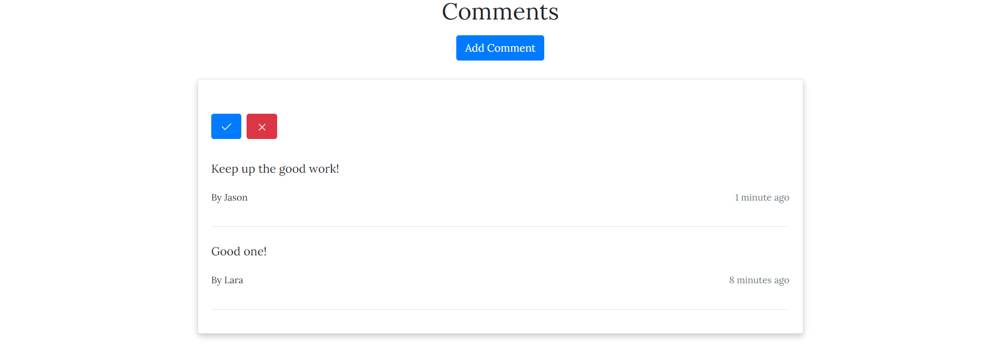

<h1 align="center">Django-Blog</h1>

Django-Blog is a Full Stack Django Website which allows you to create blog posts with Medium style formatting using the open source [Medium Editor](https://github.com/yabwe/medium-editor).

[](https://cedarfall-blog.herokuapp.com/)
[](https://www.python.org/)
[](https://www.djangoproject.com/)

### Try It Out

**Link:** https://cedarfall-blog.herokuapp.com/

**Test Username:** John

**Test Password:** pass@123

### Local Installation

1. Clone this repository to your local machine and `cd` into it.

2. Create a virtual environment using
   
   ```
   python3 -m venv myvenv
   
   # Or
   
   python -m venv myvenv
   ```
   `myvenv` will be the name of your virtual environment.
   
3. Activate the virtual environment

   ```
   myvenv\Scripts\activate
   ```

4. Install the requirements given in `requirements.txt`

   ```
   pip install -r requirements.txt
   ```

5. Inside `settings.py` file make the following changes:

   ```python
   # import django_heroku
   
   SECRET_KEY = "123"
   
   DEBUG = False
   
   # django_heroku.settings(locals(), allowed_hosts=False, secret_key=False)
   ```

6. You now have all the requirements for running the Django app in your browser. However we don't have a database connection yet, we are using the `Heroku PostgreSQL` database in production. Locally we will use the `sqlite` database available  by default. To use this database, you just need to migrate your models using `python manage.py makemigrations` and then `python manage.py migrate`

7. Next step is to create a `super user` that will allow us to create and edit blog posts, approve comments etc. Create a superuser using `python manage.py createsuperuser` and follow the prompts.

8. Locate the `manage.py` file and navigate to its directory. Run the command to start the server

   ```
   python manage.py runserver
   ```

9. Copy the URL and open in your browser.

10. You now should have the complete app running locally.

### **Features**

#### **Responsive UI**







#### Medium Style Editor

Quickly add and style your content with various tabs available in the helper tool.



**Custom Styling**

You can also use your own `HTML` and styling to get the look you want by using the `HTML` tags, this also provides you with full access to `Bootstrap` classes.

This may pose a security risk as discussed in the **Limitations** section.

#### Drafts

Clear separation between the main blog and your drafts, posts aren't visible to the general public unless you `publish` them



#### Easy Edits

Easily edit posts and add comments in your blog post. Anyone can come and add comments to your post.


#### Approve Comments

Only approved comments are visible to visitors, easily approve or remove comments on your post.



#### **Custom Time Filter**

Custom template filter used to filter time based on current time. This mimics the functionality of Facebook or YouTube.



### Limitations

- Although the `HTML` tab in the Medium Style Editor provides great flexibility, it should be disabled because of possibility of XSS attacks.
- There is no direct way to attach classes to the Medium Style Editor's options. For example when you use the `image` option, no classes are attached to that image, making it unresponsive. Here we have used JavaScript OnClick Event Listeners to attach classes to make the images responsive.
- Image uploads are not allowed to save space, any images that have been shown in this project have been online images through Pexels.
- The data or rather the HTML that the Medium Style Editor generates is not clean.

### Further Work

To address these limitations, we could make use of `Document.js` which produces clean JSON data. We must also remove the `HTML` option for styling and instead provide some abstraction for complicated styling to ensure better use and security.

### Acknowledgements

This project was created with reference to **Jose Portilla's Full Stack Django Development Course**, although it has been heavily modified.

Also thanks to [Pexels](https://www.pexels.com/) for their amazing images.
